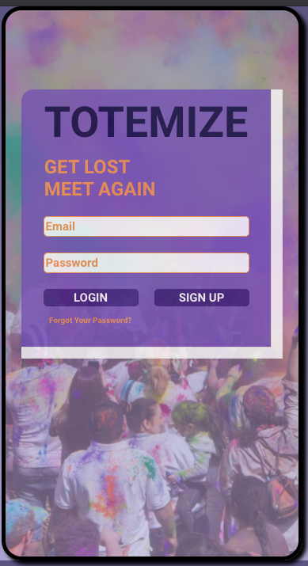
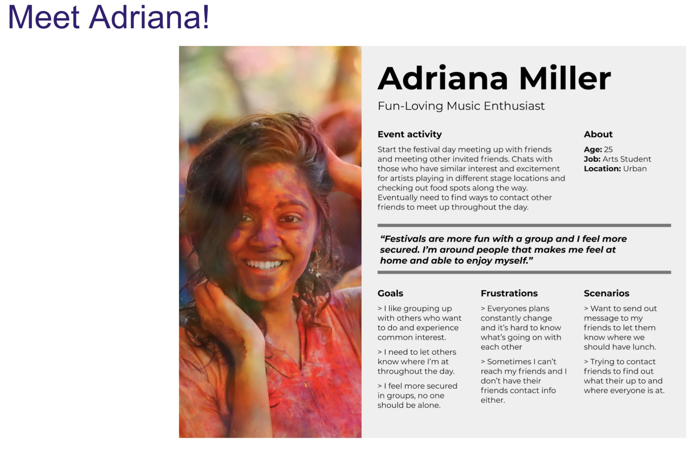

# Getting Started with Create React App

This project was bootstrapped with [Create React App](https://github.com/facebook/create-react-app).

## images of app

Link to app 
https://friendly-sinoussi-f96db3.netlify.app/

## How

Our app was created by two designers and four developers during a Hackathon sprint. We all concluded that its hard to find friends during large gatherings or places that friends can easily get lost and we wanted something that could solve the issue all in one rather than through multiple apps. Totemize was created at that moment.

Designers worked on the front end, giving us a general look and feel, branding and reasoning behind what we were doing and the developers put art into practical existance to work as imagined. Through collaboration and communication our team went through multiple check-ins, constant commits as well as offering help as needed and debugging together. In the end, we successfully created an app with full CRUD functionality for users and friends and future iterations would add full crud functionality to events.

## installation instructions
please use `npm i` to install axios, jsonwebtoken, react, react-dom, and react-router-dom.

## user story

[Link to presentation](https://docs.google.com/presentation/d/1tE5ZKgdR9sb6IDTDAwWxN7lfKzvSmCqkLIFNkfZPnBg/edit#slide=id.ge4c5d93fc4_0_16)

## link to wireframes
[Link to wireframes](https://www.figma.com/file/luE1KFuzq79dBeMdgo7y5p/Hackathon-Festival-Totem-Pole-app?node-id=0%3A1)

## hurdles
working collaboratively was a challenge but not something new and unknown to all of us. we all adapted to each other towards the middle and came together to finish strong. A lot of bugs that happened were concerning databases and connecting M:M relationships with separate 1:M relationships. Unfinished bugs were styling things that could have been cleaned up.

we had fun :)